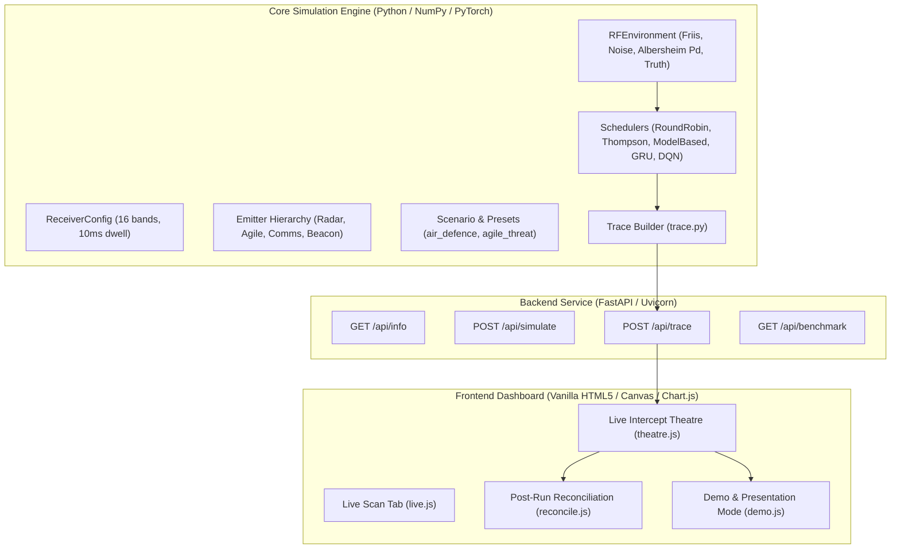

# Implementation Plan: Live Intercept Theatre & Smart Scan Architecture

**Project**: Smart Scan: Machine Learning-Based Electronic Support (ES) Receiver Scheduler  
**Document**: Technical Implementation Plan, Architectural Design & Phased Roadmap  
**Version**: 2.0  
**Date**: October 2026  

---

## 1. System Overview & Technology Stack

The Smart Scan system provides a complete pipeline from electromagnetic RF simulation and AI scheduling algorithms up to an interactive visual cockpit and deterministic post-run reconciliation suite.



### Technology Stack
- **Backend Core**: Python 3.10+, NumPy, PyTorch (GRU & DQN), SciPy.
- **API Framework**: FastAPI, Pydantic, Starlette, Uvicorn ASGI server.
- **Frontend Architecture**: Pure HTML5 Canvas, Vanilla ECMAScript (ES2022+), CSS3 Flexbox/Grid.
- **Charting**: Vendored `chart.umd.min.js` (Chart.js v4) without external CDN or NPM runtime dependencies.
- **Offline Delivery**: Complete zero-network offline operation capability with precomputed fallback bundles.

---

## 2. Directory Structure & Key Files

```
ewarfare/EW_SIH-/
├── ewscan/                       # Core RF simulation & scheduling package
│   ├── emitters.py               # Emitter physics: Scanning, Tracking, Agile, Comms, Beacon
│   ├── environment.py            # RF channel: Friis path loss, thermal noise, Albersheim Pd
│   ├── metrics.py                # Interception ratio, information age, Pd, Pfa calculation
│   ├── predictor.py              # 2-layer GRU sequence-to-sequence activity predictor
│   ├── receiver.py               # ES receiver parameters (16 bands, 1 GHz IBW, 10ms dwell)
│   ├── rl.py                     # Deep Q-Network (DQN) implementation & experience replay
│   ├── scenario.py               # Scenario presets (air_defence, agile_threat, dense_comms)
│   ├── schedulers.py             # Schedulers & run_episode loop
│   ├── theory.py                 # Mathematical periodic intercept analytical formulas
│   └── trace.py                  # Live Intercept Theatre execution trace generator
│
├── server/
│   └── app.py                    # FastAPI application & API endpoints
│
├── web/                          # Web dashboard frontend
│   ├── index.html                # Main application UI structure & navigation
│   ├── style.css                 # Base dashboard theme
│   ├── app.js                    # Tab lifecycle, API client, existing tabs
│   ├── theatre.js                # Phase 2: Canvas animation engine (Ring, Strip, Pattern)
│   ├── theatre.css               # Phase 2: Dark cockpit theater theme & stage layouts
│   ├── reconcile.js              # Phase 3: Post-run reconciliation & virtualized panes
│   ├── reconcile.css              # Phase 3: Reconciliation cards, chips & gap styles
│   ├── demo.js                   # Phase 4: One-click demo, presentation mode, captions
│   ├── demo.css                  # Phase 4: Captions, presentation dock, help overlay
│   ├── demo_traces/
│   │   └── demo_compare.json     # Precomputed offline fallback demo trace bundle
│   └── vendor/
│       └── chart.umd.min.js      # Vendored Chart.js library
│
├── scripts/
│   └── make_demo_trace.py        # Offline demo bundle generator script
│
├── tests/
│   └── test_trace.py             # Comprehensive test suite for trace generation & API
│
├── evaluate.py                   # Multi-seed benchmark evaluator
├── train.py                      # Training script for GRU predictor & DQN
├── METHODOLOGIES.md              # Mathematical & algorithmic methodologies reference
└── IMPLEMENTATION_PLAN.md        # Technical implementation & phased engineering plan
```

---

## 3. Phased Implementation Roadmap

### Phase 1: Backend Trace Builder & API Endpoint
- **Objective**: Construct compact, JSON-serializable execution traces capturing message bursts, per-slot receiver dwell, and deterministic detection outcomes without altering simulation physics or RNG consumption.
- **Key Modules**:
  - `ewscan/trace.py`: Implemented `build_trace(scheduler_name, scenario, seed, n_slots)`.
  - Contiguous burst segmentation with stable message IDs `(start_slot, band, emitter_id)`.
  - Four deterministic outcome states: `INTERCEPTED`, `PARTIAL`, `MISSED_NOT_LISTENING`, `MISSED_NOT_DETECTED`.
  - Consistency verification asserting `trace_ir_any == compute_metrics.intercept_ratio`.
  - Added operational phase logging (`coverage`, `acquisition`, `tracking`) in `ModelBasedScheduler`.
  - `server/app.py`: Created `POST /api/trace` endpoint with schema validation.

### Phase 2: Live Intercept Theatre Animated Scene
- **Objective**: Develop a 60 FPS HTML5 Canvas animation presenting the EW battlefield across three synchronized perspectives.
- **Key Modules**:
  - `web/theatre.js` & `web/theatre.css`:
    1. **Network View**: Circular radial node layout with central receiver, eased antenna rotation, expanding shockwave burst pulses, and flying message packets.
    2. **Time-Frequency Strip**: Continuous 2D spectrogram matching `explanation.png`, solid green borders for caught bursts, dashed red borders for missed bursts, connected dwell sawtooth line.
    3. **Visiting Pattern & Heat Bar**: Stepped dwell sequence, band histogram, operational mode badge, live ticker.
  - Controls: Play/Pause, Step $\pm 1$, Scrubber, Speed ($0.25\times\text{–}16\times$), Future bursts ghosting toggle, Dual-scene Compare mode.

### Phase 3: Post-Run Reconciliation View
- **Objective**: When playback ends or on demand, reconcile ground-truth transmissions against decoded messages to audit unintercepted communications.
- **Key Modules**:
  - `web/reconcile.js` & `web/reconcile.css`:
    1. **Summary Cards**: % Intercepted, % Missed (Not Listening), % Missed (Not Detected), % Partial, False Alarms, Threat-Weighted IR, and backend agreement check.
    2. **Synchronized Paragraph Panes**: Aligned row-by-row stream of Transmitted vs Decoded chips. Unintercepted bursts appear as prominent gap chips (`[✖ NOT RECEIVED · should come from Band X · Emitter · slots a-b]`).
    3. **Windowed Virtualization**: Fast DOM recycling for 1,000–5,000+ message runs with 60 FPS scrolling.
    4. **Interactions**: Hover tooltips with physical reasons for misses; click to seek animation playhead and pulse the band node in the radar view.
    5. **Chart.js Stacked Bar & Table**: Per-band stacked distribution; clicking a bar filters the panes.
    6. **Compare Diff Engine**: Isolates messages captured exclusively by one scheduler.
    7. **Data Exporters**: Direct CSV and JSON export.

### Phase 4: Demo, Presentation Mode & Polish
- **Objective**: Provide an executive presentation layer with one-click demo orchestration, guided narration captions, projector-ready presentation mode, snapshots, and offline fallbacks.
- **Key Modules**:
  - `web/demo.js` & `web/demo.css`:
    1. **One-Click "▶ Run Demo"**: Automatically executes `air_defence` seed 1 comparing Round-robin vs Model-based (+186% gain), plays at $2\times$ speed, and opens reconciliation.
    2. **Guided Narration Captions**: Dynamic event-driven captions at key operational milestones (start, first missed burst on band just left, mode lock-on, first smart intercept, final comparative headline).
    3. **Presentation Mode**: Fullscreen, hides navbar/controls, floating auto-hiding glass playbar dock, high-contrast typography.
    4. **Snapshots & Print Report**: Canvas composite scene export (PNG) and `@media print` PDF report generation.
    5. **Offline Fallback**: Bundled `web/demo_traces/demo_compare.json` with fallback detection badge.
    6. **UX Polish**: Scene reset button, loading spinner overlay, and interactive help modal (key `?`).

---

## 4. Key Data Schemas

### 4.1 Trace JSON Schema (`POST /api/trace`)
```json
{
  "meta": {
    "scheduler": "round_robin",
    "scenario": "air_defence",
    "seed": 1,
    "n_slots": 1000,
    "slot_duration_s": 0.01,
    "slot_duration_ms": 10.0,
    "generated": "2026-10-03 18:45:00"
  },
  "bands": [
    {"index": 0, "f_lo_ghz": 2.0, "f_hi_ghz": 3.0, "label": "B00 · 2-3 GHz"}
  ],
  "emitters": [
    {"id": 0, "name": "Search-A", "type": "scanning_radar", "color_key": "search_a", "threat": 3, "bands": [2]}
  ],
  "dwell": [0, 1, 2, 3, 4, 5, 6, 7, 8, 9, 10, 11, 12, 13, 14, 15],
  "detect": [0, 0, 1, 0, 0, 0, 0, 0, 0, 0, 0, 0, 0, 0, 0, 0],
  "phase": ["coverage", "coverage", "acquisition", "tracking"],
  "messages": [
    {
      "id": 0,
      "emitter_id": 0,
      "emitter_name": "Search-A",
      "type": "scanning_radar",
      "color_key": "search_a",
      "band": 2,
      "start_slot": 97,
      "end_slot": 100,
      "power_dbm": -68.4,
      "threat": 3,
      "payload": "SEARCH-A#00 B02 t=97"
    }
  ],
  "outcomes": [
    {
      "message_id": 0,
      "status": "INTERCEPTED",
      "first_hit_slot": 98,
      "n_hit_slots": 3,
      "n_listen_slots": 3,
      "listened_bands_during": [2]
    }
  ],
  "false_alarms": [
    {"slot": 233, "band": 4}
  ],
  "summary": {
    "status_counts": {"INTERCEPTED": 106, "PARTIAL": 0, "MISSED_NOT_LISTENING": 378, "MISSED_NOT_DETECTED": 0},
    "status_percentages": {"INTERCEPTED": 21.9, "PARTIAL": 0.0, "MISSED_NOT_LISTENING": 78.1, "MISSED_NOT_DETECTED": 0.0},
    "metrics": {"intercept_ratio": 0.219, "threat_weighted_ir": 0.245, "pfa": 0.0001},
    "consistency": {"trace_ir_any": 0.219, "diff_vs_metrics": 0.0}
  }
}
```

---

## 5. Performance, Memory & Scalability

1. **Pre-Indexing by Band and Time**:
   - `buildMessageIndex(trace)` splits all bursts into an array of bands `byBand[b]` during initialization ($O(M)$ work once).
   - Per-frame rendering filters only bursts overlapping the visible window ($O(K)$ where $K \ll M$).
2. **Deterministic Pure Function Rendering**:
   - Packets, pulses, and dwell markers are calculated as mathematical functions of `playheadSlot`.
   - Seeking backward or forward never leaks particle state or breaks synchronization.
3. **Windowed Virtualization in Reconciliation**:
   - Fixed row height ($44\text{ px}$) allows direct computation of the visible row slice:
     $$\text{startRow} = \left\lfloor \frac{\text{scrollTop}}{44} \right\rfloor - \text{buffer}$$
   - Only $\sim 25$ DOM nodes are rendered at any time regardless of whether the scenario contains $500$ or $5,000$ messages.
4. **DevicePixelRatio Scaling**:
   - Canvases automatically adapt to high-DPI (Retina / 4K) displays using `window.devicePixelRatio` scaling.

---

## 6. Verification & Quality Assurance Strategy

| Test Suite | File | Coverage | Acceptance Gate |
| :--- | :--- | :--- | :--- |
| **Trace Core Properties** | `tests/test_trace.py` | Validates lengths, types, band index bounds, outcome alignment | $100\%$ pass |
| **Trace Determinism** | `tests/test_trace.py` | Exact bit-for-bit repeatability across identical seed runs | $100\%$ pass |
| **Cross-Scheduler Message Invariance** | `tests/test_trace.py` | Same seed yields identical ground-truth bursts for all schedulers | $100\%$ pass |
| **Interception Consistency** | `tests/test_trace.py` | Asserts `\|trace_ir - compute_metrics.ir\| <= 0.001` | $100\%$ pass |
| **API Endpoints** | `tests/test_trace.py` | HTTP status codes, validation, 400 on invalid parameters | $100\%$ pass |
| **JavaScript Syntax** | `node -c` | Syntax verification across all 4 frontend modules | Exit code 0 |
| **Benchmark Non-Regression** | `evaluate.py` | Asserts existing simulation and FoM calculations intact | Zero regression |

---

## 7. Execution Guide

### Starting the Application Server
```bash
python run_server.py
# Access dashboard at: http://127.0.0.1:8000
# Navigate to tab: "Live Theatre"
```

### Running the Test Suite
```bash
python tests/test_trace.py
```

### Re-generating Offline Fallback Demo Bundle
```bash
python scripts/make_demo_trace.py
```
