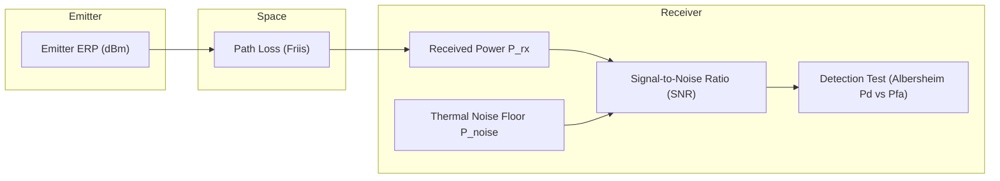
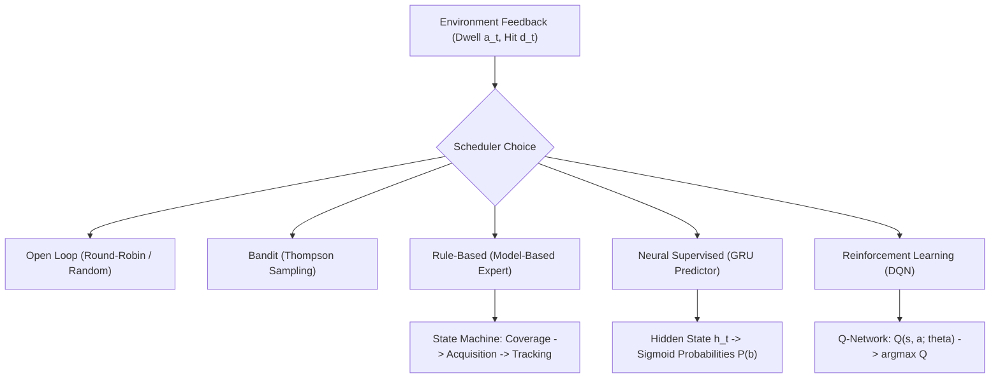
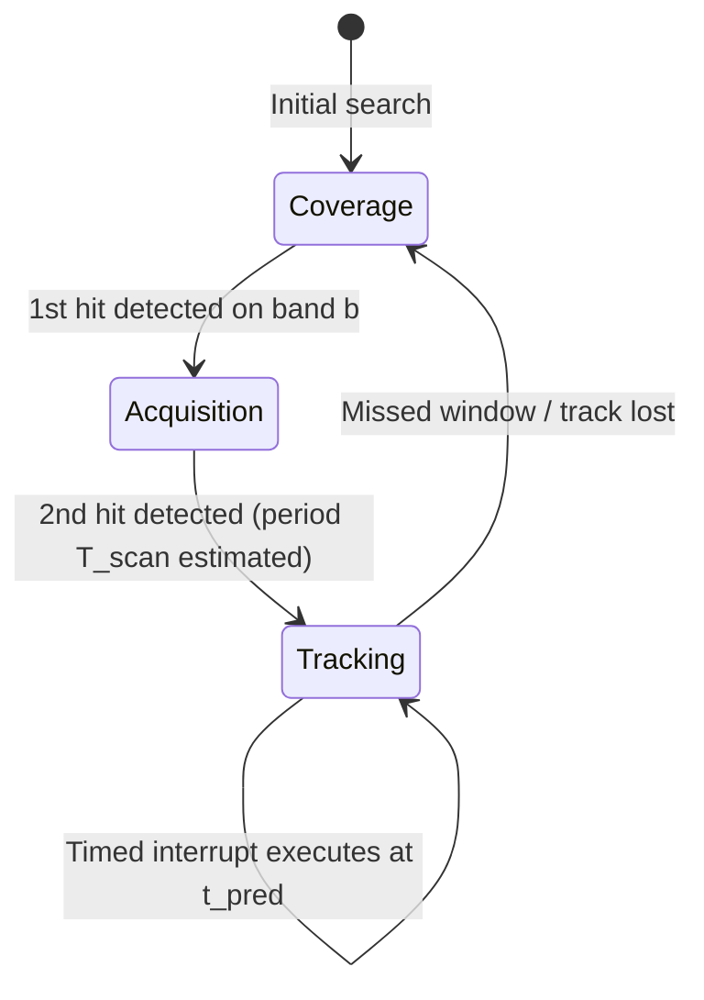
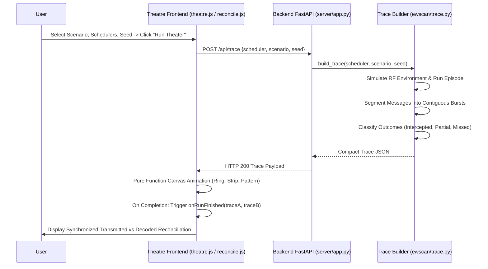

# Methodologies & Technical Architecture: Smart Scan ES Receiver Scheduler

**Project**: Smart Scan: Machine Learning-Based Electronic Support (ES) Receiver Scheduler  
**Document**: Mathematical, Physical, and Algorithmic Methodologies Reference  
**Version**: 2.0 (Includes Live Intercept Theatre & Reconciliation)  
**Date**: October 2026  

---

## Table of Contents
1. [Operational Problem Formulation](#1-operational-problem-formulation)
2. [RF Physics & Detection Theory](#2-rf-physics--detection-theory)
   - 2.1 Free-Space Path Loss & Friis Transmission Equation
   - 2.2 Receiver Noise Floor & Thermal Physics
   - 2.3 Signal-to-Noise Ratio (SNR)
   - 2.4 Statistical Detection Theory & Albersheim ROC
3. [Emitter Modeling & Signal Kinematics](#3-emitter-modeling--signal-kinematics)
   - 3.1 Scanning Radar (Search / Early Warning)
   - 3.2 Tracking Radar (Fire-Control)
   - 3.3 Frequency-Agile Radar (Cyclic / Random Frequency Hopping)
   - 3.4 Tactical Communications Nets (Push-to-Talk & Datalink)
   - 3.5 Navigation Beacons
4. [Receiver Architecture & Constraints](#4-receiver-architecture--constraints)
5. [Scheduling Algorithms & Intelligence Engines](#5-scheduling-algorithms--intelligence-engines)
   - 5.1 Baseline Open-Loop Sweeps (Round-Robin, Random Sweep, Uniform Random)
   - 5.2 Multi-Armed Bandit: Thompson Sampling
   - 5.3 Expert System: Model-Based Periodic Intercept Scheduler
   - 5.4 Supervised Learning: Recurrent Neural Network (GRU Predictor)
   - 5.5 Reinforcement Learning: Deep Q-Network (DQN)
6. [Figures of Merit & Evaluation Framework](#6-figures-of-merit--evaluation-framework)
7. [Live Intercept Theatre & Post-Run Reconciliation Methodologies](#7-live-intercept-theatre--post-run-reconciliation-methodologies)

---

## 1. Operational Problem Formulation

In modern Electronic Warfare (EW), an **Electronic Support (ES)** receiver is tasked with surveying a wide frequency spectrum (typically $2\text{ GHz}$ to $18\text{ GHz}$) to detect, identify, and locate non-cooperative RF emitters in real time. 

### The Core Tactical Dilemma
- **Instantaneous Bandwidth vs. Surveillance Spectrum**: The receiver possesses an instantaneous bandwidth ($B_{\text{rx}} = 1\text{ GHz}$) that is substantially narrower than the total surveillance band ($\Delta F = 16\text{ GHz}$).
- **Single-Tuner Dwell Constraint**: At any discrete time slot $t$ of duration $\tau_{\text{dwell}} = 10\text{ ms}$, the receiver can tune to exactly **one** of $N = 16$ contiguous frequency bands:
  $$\text{Action: } a_t \in \{0, 1, \dots, N-1\}$$
- **Blindness Window**: While dwelling on band $a_t$, the receiver is completely blind to signals transmitting on all other $N - 1$ bands:
  $$\forall b \neq a_t, \quad \text{Observation on band } b = \emptyset$$
- **Asynchronous Emitter Pulses**: Adversary emitters transmit intermittent, narrow-beam or frequency-hopping bursts without prior coordination. If an emitter pulses while the receiver is listening elsewhere, the transmission is lost forever (**Missed: Not Listening**).

The objective is to synthesize an optimal scheduling policy $\pi(a_t \mid \mathcal{H}_t)$ operating over detection history $\mathcal{H}_t$ that maximizes the probability of intercepting high-threat, intermittent emitters while maintaining continuous situational awareness.

---

## 2. RF Physics & Detection Theory

The simulation is built upon deterministic RF link budget calculations coupled with stochastic Gaussian noise fluctuations.

### 2.1 Free-Space Path Loss & Friis Transmission Equation
For an emitter operating at carrier frequency $f$ (wavelength $\lambda = c / f$) transmitting at effective radiated power $\text{ERP}_{\text{dBm}}$ located at range $R\text{ (km)}$:

$$\text{FSPL}(R, f) = 20 \log_{10}(R_{\text{km}}) + 20 \log_{10}(f_{\text{GHz}}) + 92.45 \text{ dB}$$

The received power $P_{\text{rx}}$ at the antenna terminal before receiver gain is:

$$P_{\text{rx}}\text{ (dBm)} = \text{ERP}_{\text{dBm}} - \text{FSPL}(R, f)$$

When the receiver antenna is directional or an emitter beam sweeps past the receiver, an additional off-boresight antenna attenuation pattern $G(\theta)$ modulates the power:

$$P_{\text{rx}}(t) = \text{ERP} - \text{FSPL} + G_{\text{tx}}(\theta(t))$$

### 2.2 Receiver Noise Floor & Thermal Physics
The receiver thermal noise power $P_{\text{noise}}$ across instantaneous bandwidth $B_{\text{rx}} = 1\text{ GHz}$ ($10^9\text{ Hz}$) at ambient temperature $T_0 = 290\text{ K}$ with noise figure $\text{NF} = 6.0\text{ dB}$ is:

$$P_{\text{thermal}} = k_B \cdot T_0 \cdot B_{\text{rx}}$$
$$P_{\text{thermal}}\text{ (dBm)} = -174\text{ dBm/Hz} + 10 \log_{10}(10^9\text{ Hz}) = -84\text{ dBm}$$
$$P_{\text{noise}}\text{ (dBm)} = P_{\text{thermal}} + \text{NF} = -84 + 6 = -78.0\text{ dBm}$$

### 2.3 Signal-to-Noise Ratio (SNR)
When band $b$ is active with one or more emitters, the strongest emitter dominates the channel. The effective linear Signal-to-Noise Ratio $\text{SNR}$ is:

$$\text{SNR}_{\text{dB}} = P_{\text{rx, max}} - P_{\text{noise}}$$
$$\text{SNR}_{\text{linear}} = 10^{\frac{\text{SNR}_{\text{dB}}}{10}}$$

If no emitter is active on band $b$, $\text{SNR}_{\text{dB}} = -\infty$.

### 2.4 Statistical Detection Theory & Albersheim ROC
Detection uses energy detection over $M$ independent pulses or samples. Under the Neyman-Pearson criterion with a constant false-alarm rate (CFAR) target $P_{\text{fa}} = 10^{-4}$, the detection probability $P_d$ follows **Albersheim's empirical equation** for non-fluctuating (Swerling 0/1) targets:

$$A = \ln \left( \frac{0.62}{P_{\text{fa}}} \right)$$
$$B = \ln \left( \frac{P_d}{1 - P_d} \right)$$
$$\text{SNR}_{\text{req}}(P_d, P_{\text{fa}}, M) = -5 \log_{10}(M) + \left(6.2 + \frac{4.54}{\sqrt{M + 0.44}}\right) \cdot \log_{10}\left(A + 0.12 A B + 1.7 B\right)$$

In the discrete simulation environment, $P_d$ is modeled via the sigmoid standard error function representation:

$$P_d(\text{SNR}) = \frac{1}{1 + \exp\left( -k \cdot (\text{SNR}_{\text{dB}} - \text{SNR}_{\text{threshold}}) \right)}$$

- Receiver sensitivity threshold: $\text{Sensitivity} = -85.0\text{ dBm}$ (achieving $P_d \ge 0.90$ for SNR $\ge 7\text{ dB}$).
- Ground truth detection outcomes $D(b, t) \in \{0, 1\}$ are pre-drawn using independent Bernoulli trials:
  $$\Pr(D(b, t) = 1 \mid \text{active}) = P_d(b, t)$$
  $$\Pr(D(b, t) = 1 \mid \text{silent}) = P_{\text{fa}} = 10^{-4}$$

---

## 3. Emitter Modeling & Signal Kinematics

The environment simulates 5 distinct classes of RF emitters:

| Emitter Class | Carrier Bands | Temporal Profile | Threat Level | Tactical Function |
| :--- | :--- | :--- | :---: | :--- |
| **Scanning Radar** | Fixed band $b$ | Periodic mainlobe pulse: period $T_{\text{scan}} \in [24, 150]\text{ slots}$, beamwidth $W \in [2, 7]\text{ slots}$ | $3$ | Air surveillance, early warning |
| **Tracking Radar** | Fixed band $b$ | Continuous lock-on illumination once active ($t \ge T_{\text{start}}$) | $5$ (Highest) | Target tracking, fire-control |
| **Frequency-Agile** | Hopping set $\{b_1, \dots, b_k\}$ | Hops band every $H \in [1, 5]\text{ slots}$; cyclic or uniform pseudo-random | $4$ | Multi-function acquisition / ECCM |
| **Tactical Comms** | Fixed band $b$ | Poisson / Markov on-off burst process ($\bar{T}_{\text{on}} \in [3, 25], \bar{T}_{\text{off}} \in [8, 80]$) | $2$ | Command & control voice, datalink |
| **Beacon** | Fixed band $b$ | High-rate periodic pulses: period $T \in [10, 60]$, duty cycle $1\text{–}4\text{ slots}$ | $1$ | TACAN, IFF, navigation aid |

---

## 4. Receiver Architecture & Constraints

The receiver follows a modular hardware abstraction:

- **Total Surveillance Spectrum**: $2.0\text{ GHz} \to 18.0\text{ GHz}$ ($16\text{ GHz}$ total).
- **Sub-Band Segmentation**: 16 contiguous $1\text{ GHz}$ sub-bands ($B_{00}: 2\text{–}3\text{ GHz}, \dots, B_{15}: 17\text{–}18\text{ GHz}$).
- **Time Slotting**: Synchronous time discretization into slots $t = 0, 1, 2, \dots, T-1$.
- **Dwell Duration**: $\tau_{\text{dwell}} = 10\text{ ms}$ (corresponds to $100\text{ dwells/second}$).
- **Tuning Time**: Included within the slot boundary guard band ($\le 50\ \mu\text{s}$).

---

## 5. Scheduling Algorithms & Intelligence Engines

### 5.1 Baseline Open-Loop Sweeps
1. **Round-Robin Sweep**:
   Deterministic cyclic progression across all 16 bands:
   $$a_t = t \pmod N$$
   *Weakness*: Incapable of adapting to emitter periods; misses pulses that occur while the receiver is sweeping distant bands.
2. **Random Sweep**:
   Permutes the 16 bands in random order, repeats the fixed permutation cyclically.
3. **Uniform Random Dwell**:
   Independent identically distributed (i.i.d.) discrete random sampling:
   $$a_t \sim \mathcal{U}\{0, N-1\}$$

### 5.2 Multi-Armed Bandit: Thompson Sampling
Maintains a Bayesian Beta posterior over the empirical activity rate $\theta_b \in [0, 1]$ of each band $b$:

$$\theta_b \sim \text{Beta}(\alpha_b, \beta_b)$$

- At each dwell, sample $\hat{\theta}_b \sim \text{Beta}(\alpha_b, \beta_b)$ for all $b \in \{0, \dots, N-1\}$.
- Tune to band $a_t = \arg\max_b \hat{\theta}_b$.
- Update posterior based on detection outcome $d_t \in \{0, 1\}$:
  $$\alpha_{a_t} \leftarrow \alpha_{a_t} + d_t, \quad \beta_{a_t} \leftarrow \beta_{a_t} + (1 - d_t)$$
- An exponential forgetting factor $\gamma = 0.98$ prevents stagnation in non-stationary environments.

### 5.3 Expert System: Model-Based Periodic Intercept Scheduler
The model-based scheduler employs a deterministic three-phase state machine designed specifically for periodic scanning radars:

1. **Coverage Phase**:
   Sweeps bands cyclically ($B_{00} \to B_{15}$) to maintain broad spectrum surveillance.
2. **Acquisition Phase**:
   Triggered upon detecting a hit on band $b$ at time $t_1$. The scheduler monitors band $b$ intermittently to observe the next mainlobe burst at $t_2$, estimating the scan period:
   $$\hat{T}_{\text{scan}} = t_2 - t_1$$
3. **Tracking Phase (Timed Interrupt)**:
   Predicts future arrival times:
   $$\hat{t}_{\text{arrival}}^{(k)} = t_2 + k \cdot \hat{T}_{\text{scan}}$$
   During background coverage sweeping, the scheduler schedules a **high-priority timed interrupt dwell** on band $b$ exactly at $[\hat{t}_{\text{arrival}} - 1, \hat{t}_{\text{arrival}} + 1]$ to catch the mainlobe illumination with minimal dwell overhead.

### 5.4 Supervised Learning: Recurrent Neural Network (GRU Predictor)
The GRU predictor models spectrum activity as a sequence-to-sequence multi-label time-series problem.

- **Architecture**:
  - Input vector $x_t \in \mathbb{R}^{32}$: Concatenation of one-hot action vector $e(a_t) \in \{0, 1\}^{16}$ and one-hot detection vector $e(d_t) \in \{0, 1\}^{16}$.
  - Recurrent Core: 2-layer Gated Recurrent Unit (GRU) with hidden dimension $H = 64$.
  - Output Layer: Fully-connected projection $\mathbb{R}^{64} \to \mathbb{R}^{16}$ with sigmoid activation producing predicted band activity probabilities $\hat{y}_t \in [0, 1]^{16}$.
- **Loss Function**: Masked Binary Cross-Entropy loss computed only on the observed band:
  $$\mathcal{L}_t = - \left[ y_{t, a_t} \log \hat{y}_{t, a_t} + (1 - y_{t, a_t}) \log (1 - \hat{y}_{t, a_t}) \right]$$
- **Inference Policy**:
  $$a_t = \arg\max_{b} \left( \hat{y}_{t, b} \cdot w_{\text{threat}}(b) + \lambda_{\text{age}} \cdot \sqrt{\text{age}_b(t)} \right)$$

### 5.5 Reinforcement Learning: Deep Q-Network (DQN)
The DQN learns an end-to-end scheduling policy through direct interaction with the simulated battlefield.

- **State Representation $s_t \in \mathbb{R}^{48}$**:
  1. Estimated band occupancy probabilities from the GRU predictor ($16\text{ floats}$).
  2. Normalized information age per band: $\frac{\min(\text{age}_b, 100)}{100}$ ($16\text{ floats}$).
  3. Threat priors / detection history ($16\text{ floats}$).
- **Reward Engineering**:
  $$R_t = R_{\text{intercept}} + R_{\text{threat}} + R_{\text{novelty}} - R_{\text{penalty}}$$
  - $R_{\text{intercept}} = +1.0$ if signal detected ($d_t = 1$).
  - $R_{\text{threat}} = +0.5 \times \text{ThreatLevel}(e)$ for high-priority targets.
  - $R_{\text{novelty}} = +2.0$ for the first intercept of an unknown emitter.
  - $R_{\text{age\_penalty}} = -0.01 \times \max_b(\text{age}_b)$ penalizing spectrum starvation.
- **Q-Learning Update**:
  $$\mathcal{L}(\theta) = \mathbb{E}_{\langle s, a, r, s' \rangle \sim \mathcal{D}} \left[ \left( r + \gamma \max_{a'} Q(s', a'; \theta^-) - Q(s, a; \theta) \right)^2 \right]$$

---

## 6. Figures of Merit & Evaluation Framework

| Metric | Symbol | Mathematical Formulation | Target |
| :--- | :---: | :--- | :---: |
| **Interception Ratio** | $\text{IR}$ | $\frac{N_{\text{intercepted}}}{N_{\text{total\_bursts}}}$ | $\uparrow$ Maximize |
| **Threat-Weighted IR** | $\text{TW-IR}$ | $\frac{\sum_{i} w_i \cdot \mathbb{I}(\text{hit}_i)}{\sum_i w_i}$ | $\uparrow$ Maximize |
| **Probability of False Alarm** | $P_{\text{fa}}$ | $\frac{N_{\text{false\_alarms}}}{N_{\text{silent\_dwells}}}$ | $\le 10^{-3}$ |
| **Mean Intercept Time** | $\bar{T}_{\text{int}}$ | $\frac{1}{\|E\|} \sum_{e \in E} (t_{\text{first\_hit}}(e) - t_{\text{start}}(e))$ | $\downarrow$ Minimize |
| **Mean Information Age** | $\bar{\Delta}$ | $\frac{1}{N \cdot T} \sum_{t=0}^{T-1} \sum_{b=0}^{N-1} \text{age}_b(t)$ | $\downarrow$ Minimize |
| **Hit Rate** | $\text{HR}$ | $\frac{\sum_{t=0}^{T-1} d_t}{T}$ | $\uparrow$ Maximize |

---

## 7. Live Intercept Theatre & Post-Run Reconciliation Methodologies

The Live Intercept Theatre converts raw dwell schedules and ground truth matrices into an interactive visualization and deterministic post-run audit trail.

### 7.1 Deterministic Message Burst Extraction
Ground-truth transmission bursts are extracted by finding contiguous time segments $[s, e]$ where an emitter is active on a specific band $b$. If a frequency-agile radar hops between bands, each hop dwell is extracted as a separate message.

### 7.2 Deterministic Outcome Classification
For every extracted message burst over slots $[s, e]$ on band $b$:
- $n_{\text{listen}} = \sum_{t=s}^e \mathbb{I}(a_t = b)$
- $n_{\text{hit}} = \sum_{t=s}^e \mathbb{I}(a_t = b \land d_t = 1)$
- $\text{BurstLength} = e - s + 1$

The outcome status is uniquely classified:
$$\text{Status} = \begin{cases}
\text{MISSED\_NOT\_LISTENING} & \text{if } n_{\text{listen}} = 0 \\
\text{MISSED\_NOT\_DETECTED} & \text{if } n_{\text{listen}} > 0 \land n_{\text{hit}} = 0 \\
\text{INTERCEPTED} & \text{if } (\text{BurstLength} = 1 \land n_{\text{hit}} = 1) \lor (n_{\text{hit}} = \text{BurstLength}) \\
\text{PARTIAL} & \text{if } 1 \le n_{\text{hit}} < \text{BurstLength}
\end{cases}$$

### 7.3 Interception Ratio Agreement Guarantee
To eliminate discrepancies between frontend accounting and backend training metrics:
$$\text{trace\_ir\_any} = \frac{\text{Count}(\text{INTERCEPTED}) + \text{Count}(\text{PARTIAL})}{\text{Total Messages}}$$
$$\text{diff} = |\text{trace\_ir\_any} - \text{compute\_metrics}(\text{intercept\_ratio})|$$
The reconciliation engine asserts $\text{diff} \le 0.001$. Any discrepancy is automatically highlighted with an explanatory banner.
